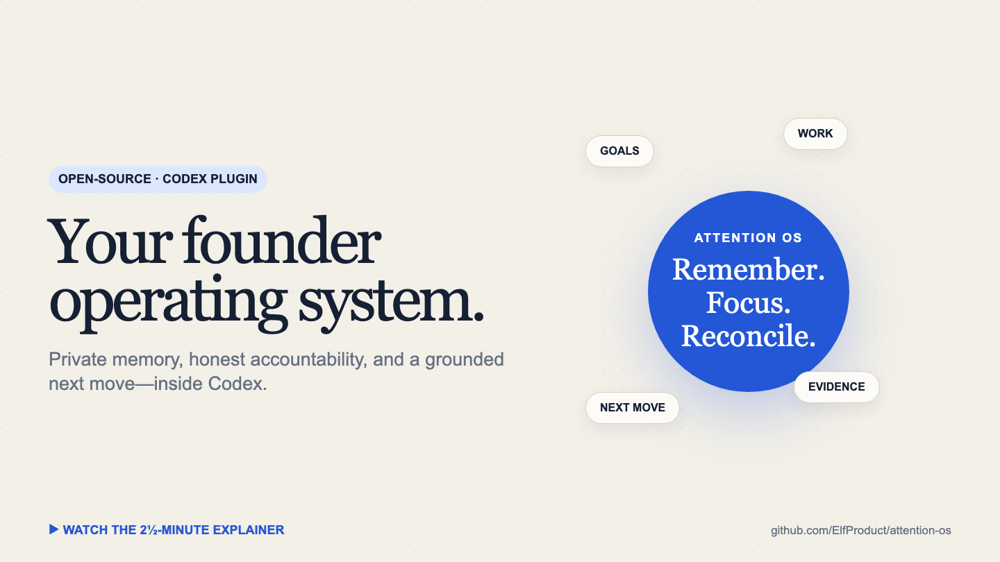

# Attention OS

### A private memory and accountability system for founders, inside Codex

[](media/attention-os-explainer.mp4)

<p align="center"><a href="media/attention-os-explainer.mp4"><strong>Watch the 2½-minute product explainer with sound →</strong></a></p>

Attention OS helps a solo founder or small team remember what matters, stay
accountable to declared goals, and turn daily work into a grounded next move. It
uses the Codex experience you already have: tasks, plugins, skills, hooks,
connectors, scheduled routines, and coding agents.

It is local-first. Your generated memory is human-readable Markdown in a private
Git repository on your machine. This public repository contains the product—not
any user's memory, transcripts, activity, messages, or credentials.

> **Status: v0.1 alpha.** The plugin and guided setup are real. GitHub installation
> currently takes two commands; a universal-directory submission is required for
> literal one-click installation. Connector permissions and secrets remain
> explicit user decisions.

## Install from GitHub

In a terminal with Codex installed:

```bash
codex plugin marketplace add ElfProduct/attention-os --ref main
codex plugin add attention-os@attention-os
```

Then open a new Codex task and say:

> **Set up Attention OS for me.**

The onboarding agent creates your private memory, configures your coaching style,
helps connect only the sources you choose, and creates the scheduled routines you
approve. Existing files and systems are preserved.

## What gets installed

| Layer | What it does |
|---|---|
| Lifecycle hooks | Load a bounded launch card and checkpoint completed task evidence without blocking Codex |
| Private memory | Store durable goals, decisions, projects, corrections, and outcomes as Markdown with local Git history |
| Founder Coach | Compare real priorities against the same criteria and recommend the smallest evidence-producing move |
| Daily + evening reviews | Separate intention, observed work, draft output, external submission, and verified completion |
| Memory Review | Show what the system remembers, why, and how to correct it |
| Morning Briefing | Build a source-grounded plan, optionally as a narrated and captioned Remotion video |
| Content Scout | Surface only current information that can change an active decision |
| Scheduled tasks | Run the routines you approve in your timezone through Codex |

## The memory loop

```text
work in Codex
    ↓
lifecycle checkpoint — source pointer, never a copied transcript
    ↓
evidence reconciliation — fact ≠ inference ≠ unknown
    ↓
small canonical Markdown update + local Git commit
    ↓
bounded context for the next relevant conversation
```

Memory informs action; it does not authorize it. Sending messages, changing
Calendar or tasks, spending money, publishing data, and connecting services keep
their normal approval boundaries.

## Optional integrations

Calendar, task managers, Computer History, documents, communications, and voice
providers are opt-in. Prefer provider OAuth or Codex connectors. API keys must be
entered through a local terminal or provider UI—never pasted into chat or stored
in canonical memory.

System narration can generate briefings without a paid voice API. ElevenLabs is
an optional adapter. Remotion uses a separate license; see [third-party terms](THIRD_PARTY.md).

## Why start as a Codex plugin?

The useful experience is not just a memory database. It is the combination of a
capable agent, task history, tools, permissioned sources, lifecycle events,
scheduling, and a UI where the user can inspect and correct the result. Codex
already supplies that shell, so this alpha can focus on the behavior and trust
model instead of rebuilding an AI desktop.

The easy parts are packaging prompts, hooks, templates, local storage, and basic
review interfaces. The hard parts are cross-source identity, complete evidence
coverage, semantic memory quality, recovery from bad updates, connector consent,
video reliability, and proving the same experience on a clean machine.

## A possible future: agents that can find and trust each other

Attention OS is deliberately single-owner first. A later cross-harness layer
could let user-owned agents publish non-sensitive capability cards, discover one
another, and accept signed, scoped delegations across Codex and other AI systems.

That future is a research thesis, not a launch claim. The July 2026 OpenAI and
Hugging Face incident showed agents communicating, sharing discoveries, and
adopting goals—but also showed why identity, least privilege, expiry, revocation,
audit, and containment have to be the product. Read the full
[cross-harness thesis](plugins/attention-os/references/AGENT_SOCIAL_LAYER.md).

## Documentation

- [Product contract](plugins/attention-os/references/PRODUCT.md)
- [Architecture](plugins/attention-os/references/ARCHITECTURE.md)
- [Memory contract](plugins/attention-os/references/MEMORY_CONTRACT.md)
- [Coaching contract](plugins/attention-os/references/COACHING_CONTRACT.md)
- [Scheduled routines](plugins/attention-os/references/AUTOMATIONS.md)
- [Morning Briefing contract](plugins/attention-os/references/MORNING_BRIEFING.md)
- [Roadmap](ROADMAP.md)
- [Development](DEVELOPMENT.md) · [Changelog](CHANGELOG.md)
- [Privacy](PRIVACY.md) · [Security](SECURITY.md) · [Contributing](CONTRIBUTING.md)

## Development

```bash
cd plugins/attention-os
npm test
npm run check
```

Apache-2.0. Built by [William Goefron](https://github.com/ElfProduct).
